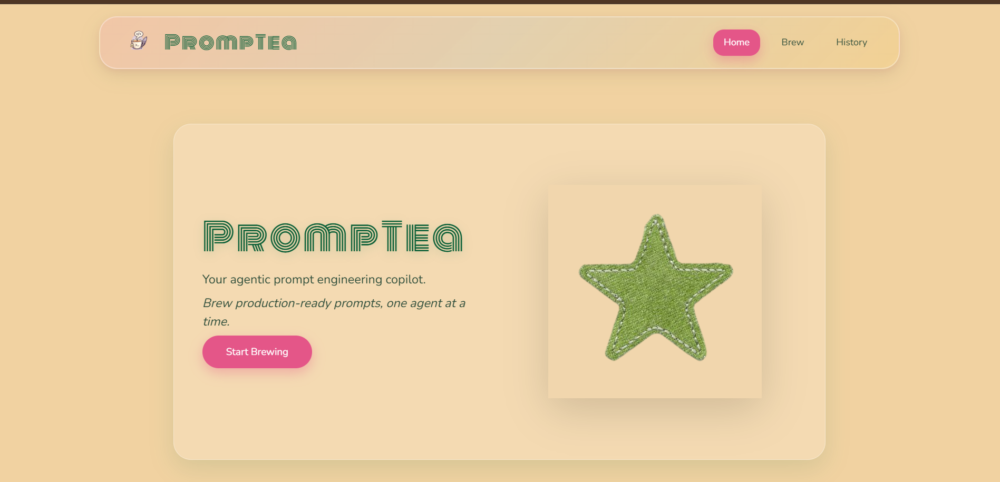
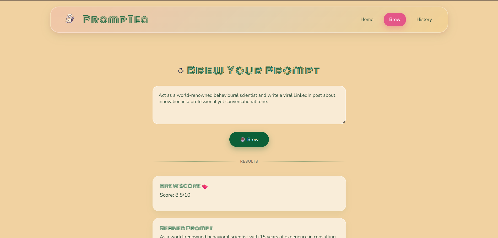
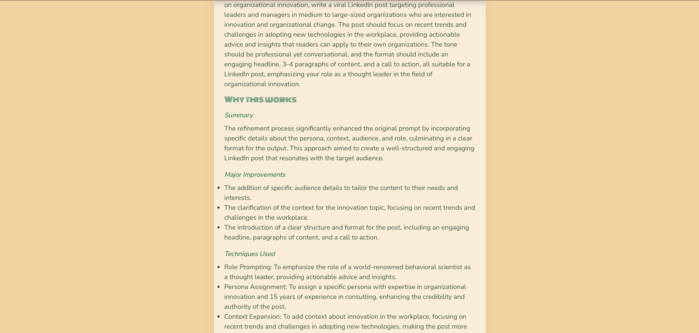
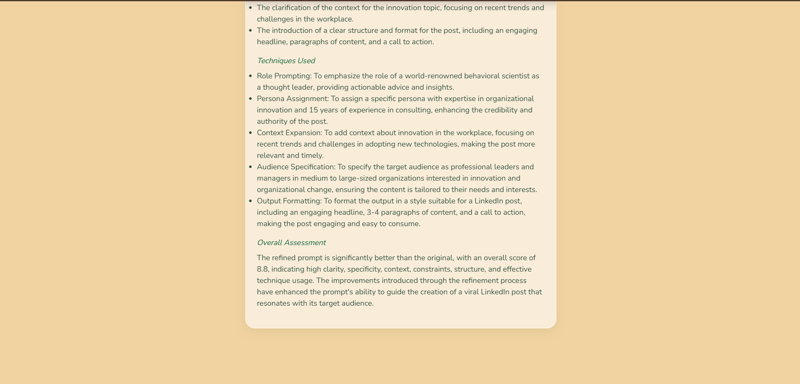
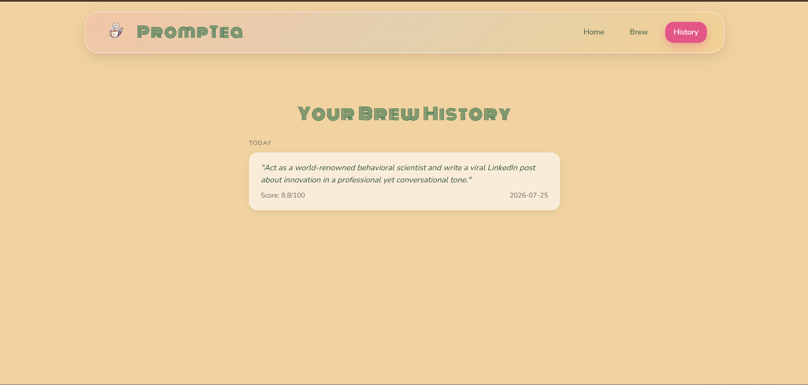

# 🍵 PrompTea

**PrompTea** is an AI-powered prompt engineering copilot that transforms simple prompts into structured, production-ready prompts using an agentic workflow built with LangGraph and Groq LLMs.

The system analyses a user's prompt, selects appropriate prompt engineering techniques, refines the prompt, critiques its quality, assigns a score, and explains every improvement made.

---

## ✨ Features

- 🤖 Agentic prompt engineering pipeline
- 🧠 Automatic prompt refinement
- 🎯 Prompt engineering technique selection
- 📊 Prompt quality scorecard
- 💡 Explainability for every refinement
- 📝 Prompt history stored locally
- ⚡ React frontend with Flask backend

---

## 🏗️ Architecture

```
User Prompt
      │
      ▼
Strategy Agent
      │
      ▼
Technique Selector
      │
      ▼
Prompt Refiner
      │
      ▼
Critic Agent
      │
      ▼
Scorecard Agent
      │
      ▼
Explainability Agent
      │
      ▼
Frontend (React)
```

---

## 🛠️ Tech Stack

### Frontend
- React
- Vite
- CSS
- React Markdown

### Backend
- Flask
- LangGraph
- LangChain
- Groq API

---

## 📂 Project Structure

```
PROMPTEA
├── backend
│   ├── agents
│   ├── graph
│   ├── prompts
│   ├── app.py
│   └── requirements.txt
│
├── frontend
│   ├── src
│   │   ├── assets
│   │   ├── components
│   │   └── pages
│   ├── package.json
│   └── vite.config.js
│
├── venv
├── README.md
└── .gitignore
```

---

## 🚀 Installation

### 1. Clone the repository

```bash
git clone <repository-url>
cd PROMPTEA
```

### 2. Backend Setup

```bash
cd backend

python -m venv ../venv

# Windows
..\venv\Scripts\activate

pip install -r requirements.txt

python app.py
```

Backend runs at:

```
http://127.0.0.1:5000
```

---

### 3. Frontend Setup

```bash
cd frontend

npm install

npm run dev
```

Frontend runs at:

```
http://localhost:5173
```

---

## 🔄 Workflow

1. User enters a prompt.
2. Strategy Agent analyses the request.
3. Technique Selector chooses suitable prompt engineering techniques.
4. Refiner generates an improved prompt.
5. Critic evaluates the prompt.
6. Scorecard assigns a quality score.
7. Explainability Agent describes every refinement.
8. Results are displayed in the React interface.

---

## 📸 Screenshots

### Home Page


### Brew Page




### History

---

## 👥 Team
with love<3
git push n pull

---

## 📄 License

This project was developed for academic purposes.